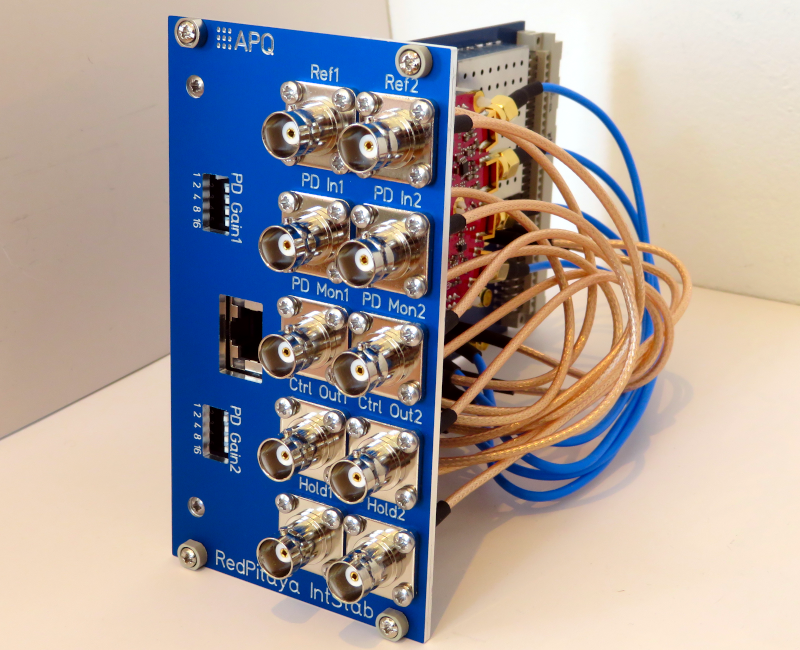

Digital Controller for Laser Intensity Stabilization
===================
This repository contains the design of a digital controller for laser intensity stabilization based on the [RedPitaya STEMlab 125-14](https://www.redpitaya.com/f130/STEMlab-board) board. The design includes schematics and readily usable PCB layouts for an analog interface integrable in standard 19-inch rack mount units using the available front panel. We recommend to use the controller with the 'pids' module of the software package [PyRPL](https://github.com/lneuhaus/pyrpl). The devices features two independent, identical channels using only one Red Pitaya board.

The controller features:

- Two independent channels for laser intensity stabilization
- Control bandwidth of 1.25 MHz
- Photodetector input with variable gain
  - Gains (1,2,4,8,16) selectable via front panel DIP switch 
  - Gain bandwidth product: 35 MHz
- Reference level input
- Digital sample and hold with 150 ns delay
- Buffered control outputs
  - Max. current: 30 mA
  - Gain bandwidth product: 35 MHz
- Buffered monitoring outputs for photodetector signal and error signal
- Integrated 5 V / 2.5 A power supply for the Red Pitaya board

Related Work
--------------------
Review of Scientific Instruments 91, 083001 (2020); [https://doi.org/10.1063/5.0009524](https://doi.org/10.1063/5.0009524)

arXiv:2009.00343 [physics.ins-det]; [https://arxiv.org/abs/2009.00343](https://arxiv.org/abs/2009.00343)

T. Preuschoff, *Laser Technologies for Applications in Quantum Information Science*, Ph.D. thesis, TU Darmstadt, 2023, [https://tuprints.ulb.tu-darmstadt.de/23242/](https://tuprints.ulb.tu-darmstadt.de/23242/)

Requirements
--------------
- RedPitaya StemLab 125-14 board: Remove the noisy [DC-offsets](https://ln1985blog.wordpress.com/2016/02/07/red-pitaya-dac-performance/).
- Dual power supply
   - +15 V (0.4 A typ. / 1.0 A max.)
   - \- 15 V (0.1 A typ. / 0.15 A max.)
- 19-inch rack mount unit (e.g. [Fischer Elektronik BGT384](https://www.fischerelektronik.de/web_fischer/en_GB/cases/N05.1/19%22%20subracks/$catalogue/fischerData/PR/BGT384_180/search.xhtml))
- TCP/IP network and control computer

License
-------
This work is released under the CERN OHL v.1.2
See www.ohwr.org/licenses/cern-ohl/v1.2 or the included LICENSE file for more information.
